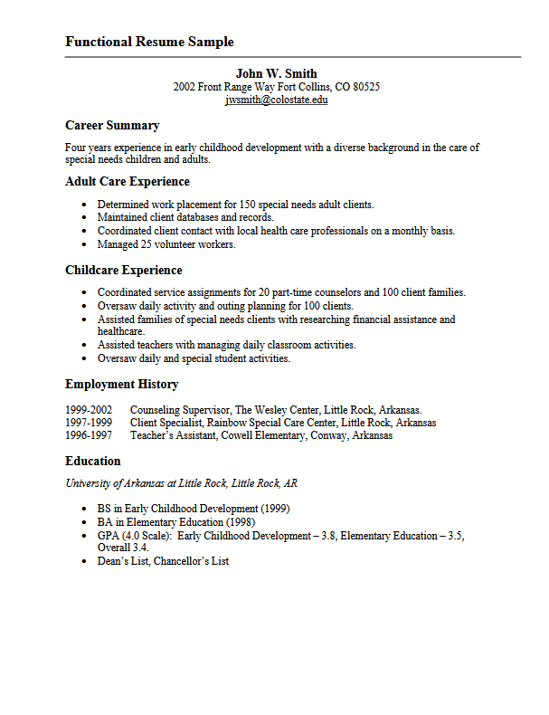
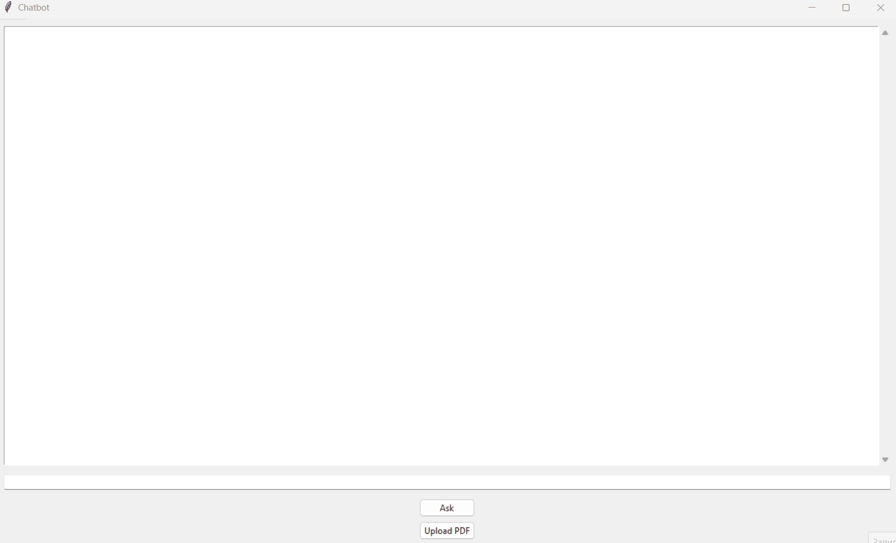
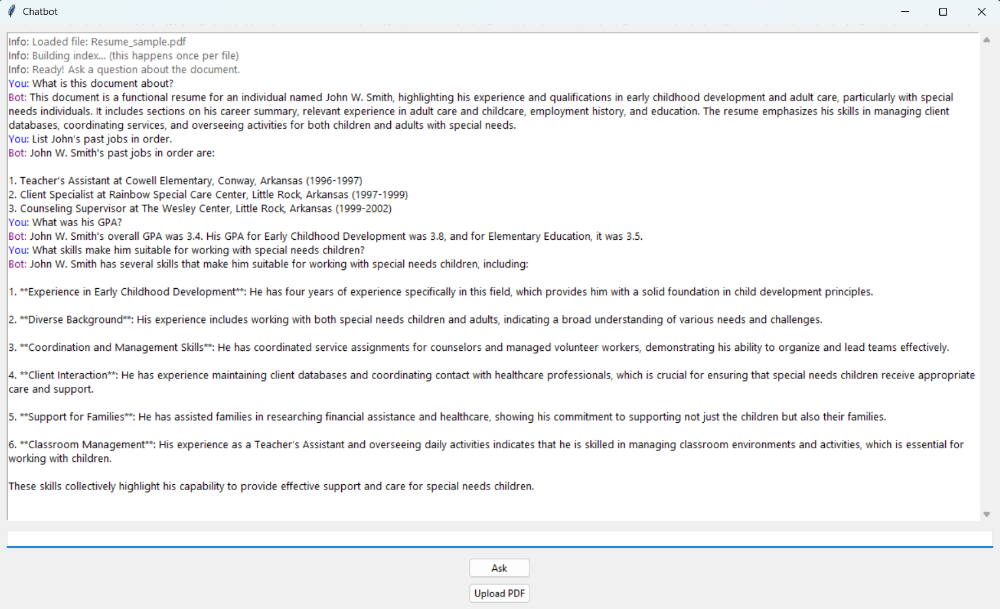

# 📄 PDF Chatbot with Tkinter & LangChain
A simple desktop chatbot built with Tkinter (Python GUI) and LangChain, that allows you to upload a PDF (like a resume, report, or research paper) and ask questions about its content using OpenAI models.
## Features
- Upload a PDF document.
- Ask questions in a chat interface.
- Answers are generated using OpenAI GPT models.
- Maintains a chat history for contextual conversations.
- Built with Tkinter GUI for a simple desktop experience.
- Uses LangChain + vector database (Chroma/FAISS) for semantic search.
## Installation
1. Clone the repository
```bash
git clone https://github.com/<your-username>/pdf-chatbot.git
cd pdf-chatbot 
```
2. Create a virtual environment
```bash
py -3.12 -m venv .venv
.\.venv\Scripts\Activate.ps1   # PowerShell (Windows)
source .venv/bin/activate      # Linux / macOS
```
3. Install dependencies
```bash
pip install -r requirements.txt
```
## Setting up your API Key
1. Create a file named .env in the project root:
```bash
OPENAI_API_KEY=sk-your-real-key-here
```
2. (Make sure .env is in your .gitignore so your key is never exposed on GitHub!)
## Usage
run the app:
```bash
python app.py
```
- Click Upload PDF to select a document.
- Type a question in the input box.
- Get answers instantly in the chat window.
## Requirements
- Python 3.12+

- OpenAI API key

- Dependencies listed in requirements.txt:
    - langchain
    - langchain-community
    - langchain-openai
    - langchain-text-splitters
    - chromadb (or faiss-cpu)
    - pypdf
    - python-dotenv
    - tkinter (bundled with Python)
## Demo
Below is an example session using a sample resume (not real personal data).
### 1. Sample Resume
This is the PDF we upload into the chatbot:

### 2. Uploading the PDF
The app confirms the file is loaded and indexed:

### 3. Asking Questions
The chatbot answers specific questions about the resume:

## How it Works
1. PDF is uploaded and converted to text.
2. Text is split into chunks and stored in a vector database (Chroma/FAISS).
3. User queries are embedded and matched to the most relevant chunks.
4. OpenAI GPT model generates an answer using the retrieved context.
## Contributing
Pull requests are welcome. For major changes, please open an issue first.
## License 
This project is licensed under the MIT License — see the [LICENSE](LICENSE) file for details.